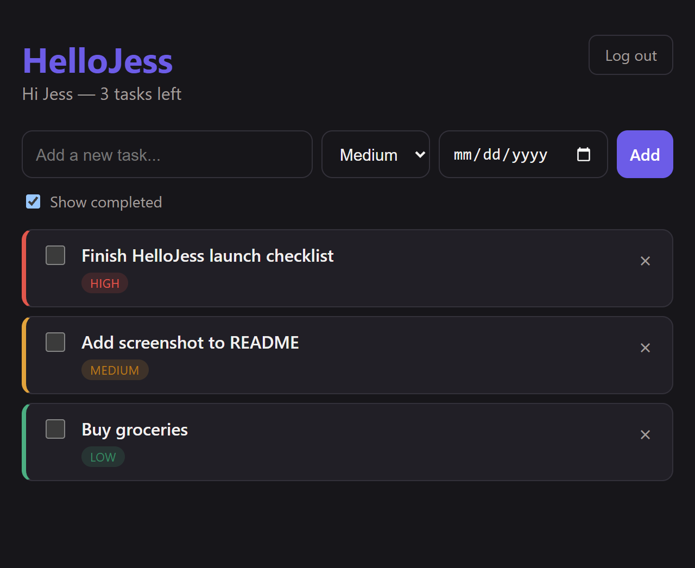

# HelloJess

HelloJess is a task/productivity app for keeping track of what you need to get done — add tasks, set a priority (low/medium/high) and an optional due date, check things off, and see them synced across every device you're logged into. It's built as three pieces sharing one backend: a **Python/FastAPI API**, a **React web app**, and a **React Native (Expo) mobile app**.



## Structure

- `backend/` — FastAPI + SQLAlchemy (SQLite) + JWT auth
- `web/` — React + TypeScript (Vite)
- `mobile/` — React Native (Expo) for iOS/Android

## Running the backend

```bash
cd backend
venv\Scripts\python.exe -m uvicorn app.main:app --reload --host 0.0.0.0 --port 8000
```

`--host 0.0.0.0` is required so phones on the same Wi-Fi can reach it. API docs: http://localhost:8000/docs

## Running the web app

```bash
cd web
npm run dev
```

Opens at http://localhost:5173. Uses `web/.env` → `VITE_API_URL` to find the backend (defaults to `http://localhost:8000`).

## Running the mobile app

```bash
cd mobile
npx expo start
```

Scan the QR code with **Expo Go** (iOS/Android) to run it on your phone, or press `a`/`i` for an emulator.

Uses `mobile/.env` → `EXPO_PUBLIC_API_URL`, currently set to `http://192.168.1.250:8000` (your machine's LAN IP). **If your IP changes or you're on a different network, update this file** — a phone can't reach `localhost`, it needs your computer's actual LAN address. Find it with `ipconfig` (look for "IPv4 Address").

For the Android emulator specifically, `http://10.0.2.2:8000` also works instead of the LAN IP.

## Accounts / auth

Register creates an account and logs you in immediately (JWT stored in browser localStorage on web, AsyncStorage on mobile). Tasks are private per-user.
