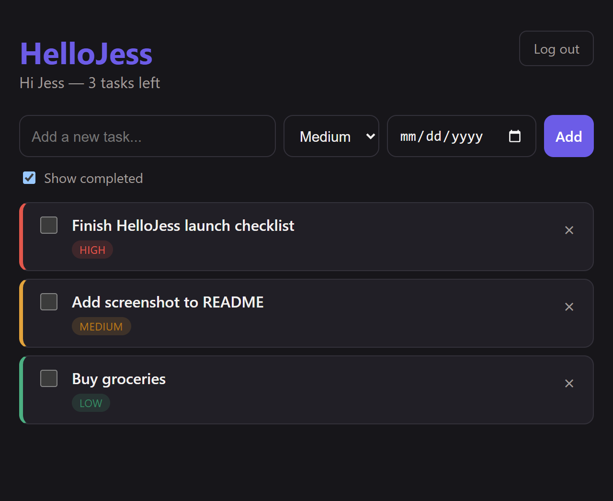

# HelloJess

HelloJess is a task/productivity app for keeping track of what you need to get done — add tasks, set a priority (low/medium/high) and an optional due date, check things off, and see them synced across every device you're logged into. It's built as three pieces sharing one backend: a **Node.js/Express API**, a **React web app**, and a **React Native (Expo) mobile app**.



## Structure

- `backend/` — Node.js + Express + MongoDB (Mongoose) + JWT auth
- `web/` — React + TypeScript (Vite)
- `mobile/` — React Native (Expo) for iOS/Android

## Running the backend

```bash
cd backend
npm install
npm run dev
```

Requires Node 22+ and a running MongoDB server. The server listens on `0.0.0.0:8000` so phones on the same Wi-Fi can reach it.

Settings live in `backend/src/config/env.js` and can be overridden with environment variables (copy `backend/.env.example` to `backend/.env`):

| Variable | Default | Purpose |
| --- | --- | --- |
| `PORT` | `8000` | Port the API listens on |
| `MONGODB_URI` | `mongodb://127.0.0.1:27017/hellojess` | MongoDB connection string |
| `CORS_ORIGIN` | `*` | Allowed browser origin(s), comma-separated |
| `SECRET_KEY` | dev placeholder | Secret used to sign login tokens — change it outside local development |

The database and its collections (`users`, `tasks`) are created automatically on first use. To browse the data in **MongoDB Compass**, connect to the same `MONGODB_URI` (locally: `mongodb://localhost:27017`) and open the `hellojess` database.

Backend layout: `src/config` (env + database connection), `src/models` (Mongoose schemas), `src/controllers` (request handling), `src/routes` (URL → controller wiring), `src/services` (`app.js` mounts the API routes under `/api`; `server.js` connects to MongoDB and starts listening).

Endpoints: `POST /api/auth/register`, `POST /api/auth/login` (JSON body `{ email, password }`), `GET /api/auth/me`, `GET /api/tasks`, `POST /api/tasks`, `PATCH /api/tasks/:id`, `DELETE /api/tasks/:id`, `GET /health`. The web and mobile apps add the `/api` prefix themselves, so their `VITE_API_URL` / `EXPO_PUBLIC_API_URL` stay as the plain server address.

## Running the web app

```bash
cd web
npm run dev
```

Opens at http://localhost:5173. Uses `web/.env` → `VITE_API_URL` to find the backend (defaults to `http://localhost:8000`).

## Running the mobile app

```bash
cd mobile
npx expo start
```

Scan the QR code with **Expo Go** (iOS/Android) to run it on your phone, or press `a`/`i` for an emulator.

Uses `mobile/.env` → `EXPO_PUBLIC_API_URL`, currently set to `http://192.168.1.250:8000` (your machine's LAN IP). **If your IP changes or you're on a different network, update this file** — a phone can't reach `localhost`, it needs your computer's actual LAN address. Find it with `ipconfig` (look for "IPv4 Address").

For the Android emulator specifically, `http://10.0.2.2:8000` also works instead of the LAN IP.

## Accounts / auth

Register creates an account and logs you in immediately (JWT stored in browser localStorage on web, AsyncStorage on mobile). Tasks are private per-user.
