# HelloJess

HelloJess is a task and habit tracker (the **TaskFlow** subject, with all four bonuses). You register, manage your own tasks (title, status, description, due date, priority), filter them, track recurring habits day by day, and see your activity on a calendar, a GitHub-style heatmap and weekly/monthly completion statistics.

It is built as three pieces sharing one backend: a **Node.js/Express API** (MongoDB), a **React web app**, and a **React Native (Expo) mobile app**.

## Screenshots

### Web app

| Tasks: filters, counter, overdue tasks | Task detail and edit |
| --- | --- |
| 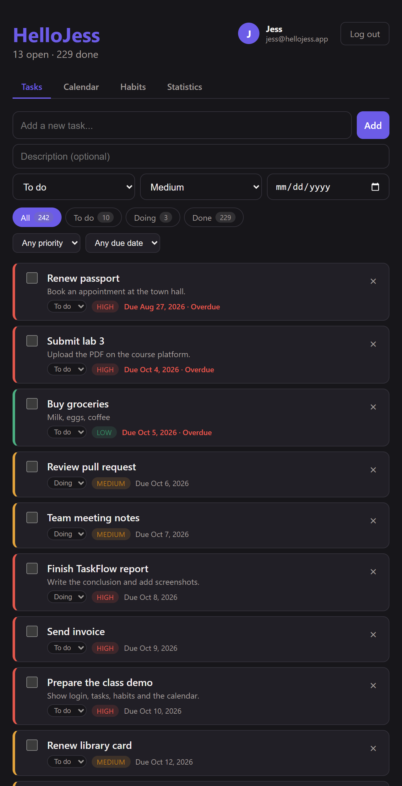 | 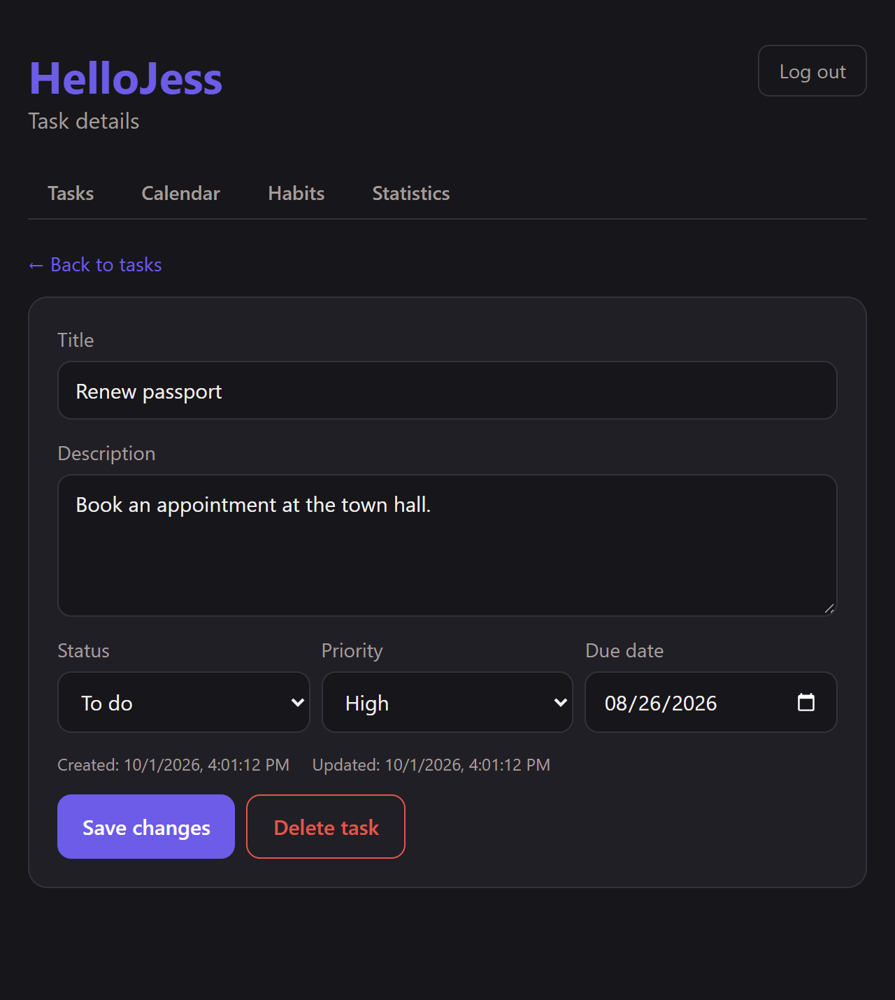 |

| Validation messages | Calendar |
| --- | --- |
| 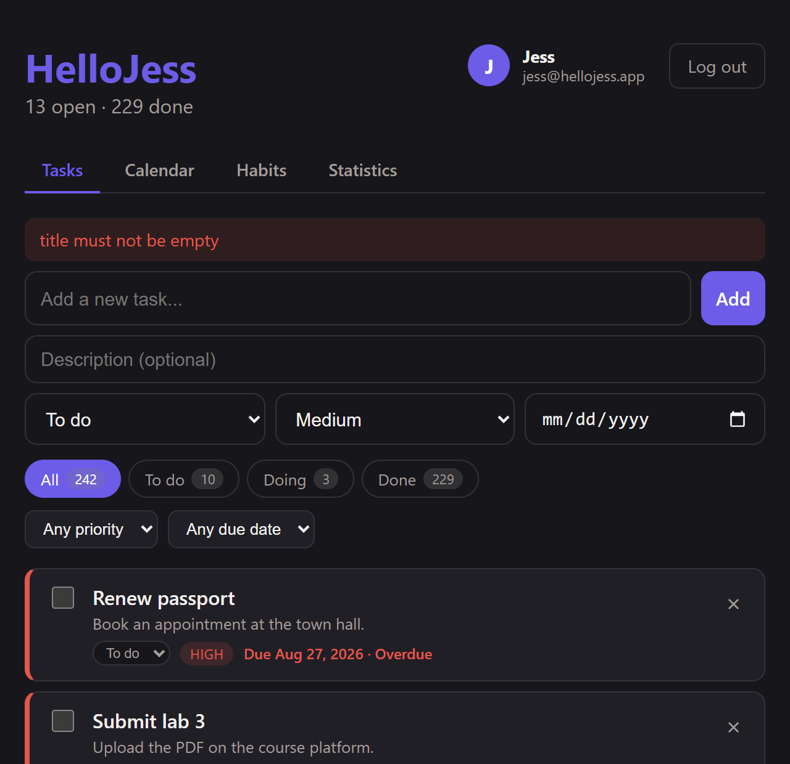 | 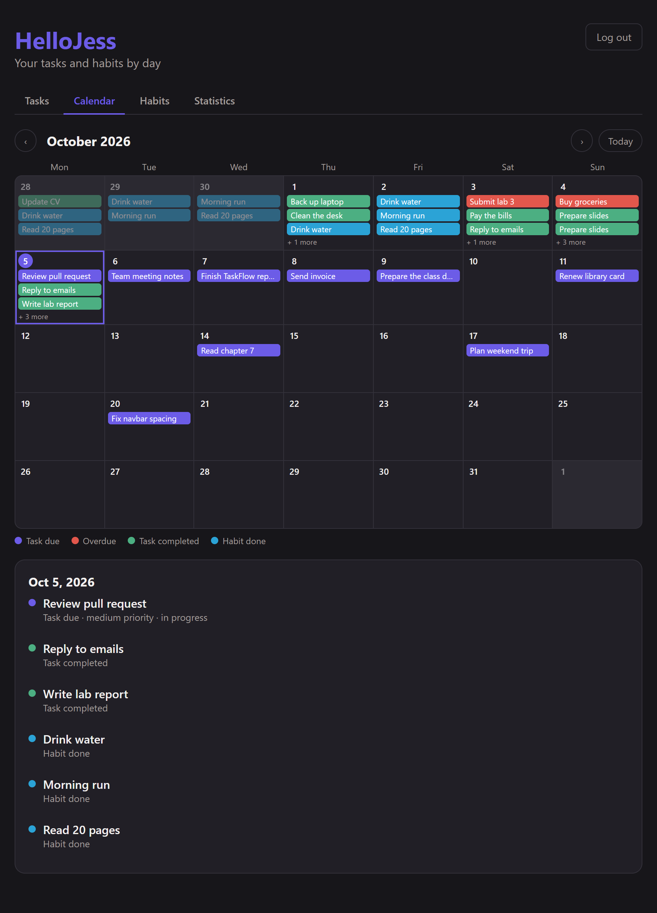 |

| Habits | Statistics: heatmap and completion rate |
| --- | --- |
| 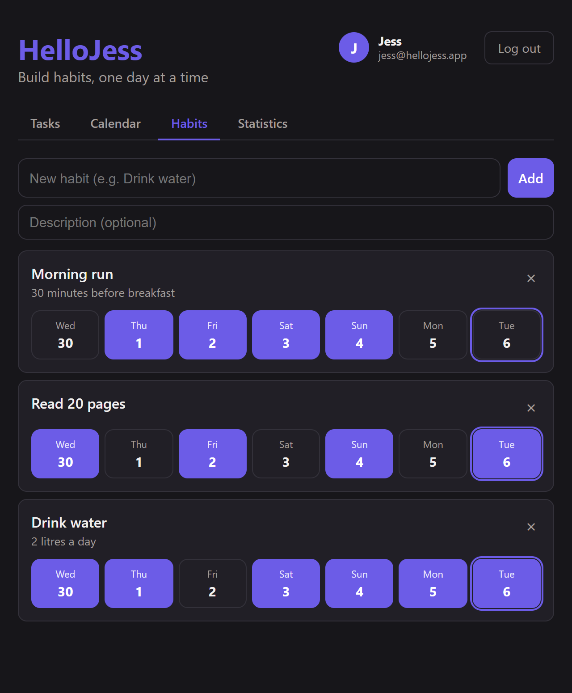 | 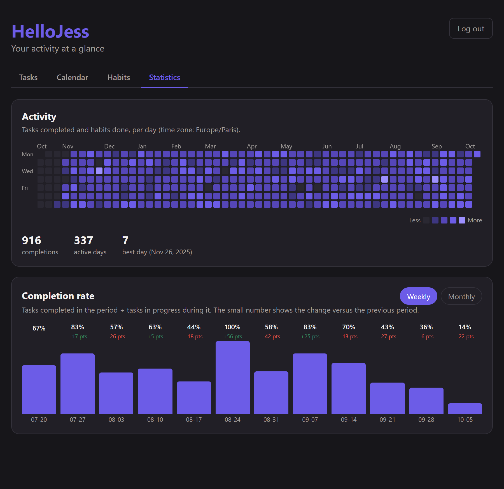 |

| Profile (click the user at the top right) |
| --- |
| 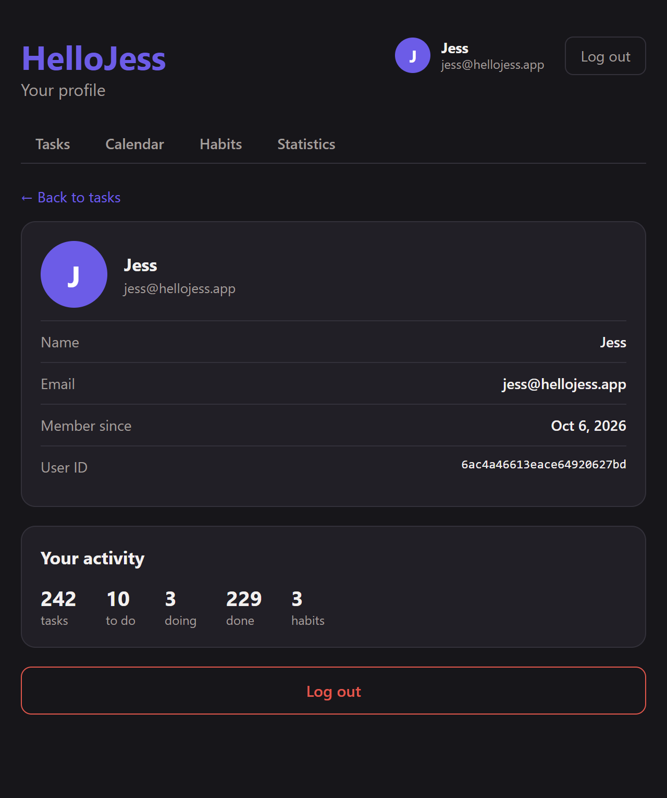 |

### Mobile app (React Native / Expo)

<table>
  <tr>
    <th>Tasks</th>
    <th>Calendar</th>
    <th>Habits</th>
    <th>Statistics</th>
    <th>Profile</th>
  </tr>
  <tr>
    <td>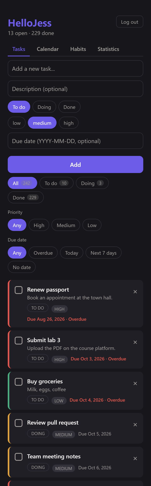</td>
    <td>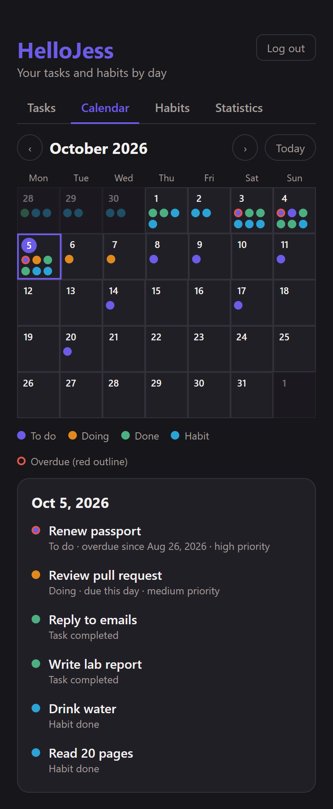</td>
    <td>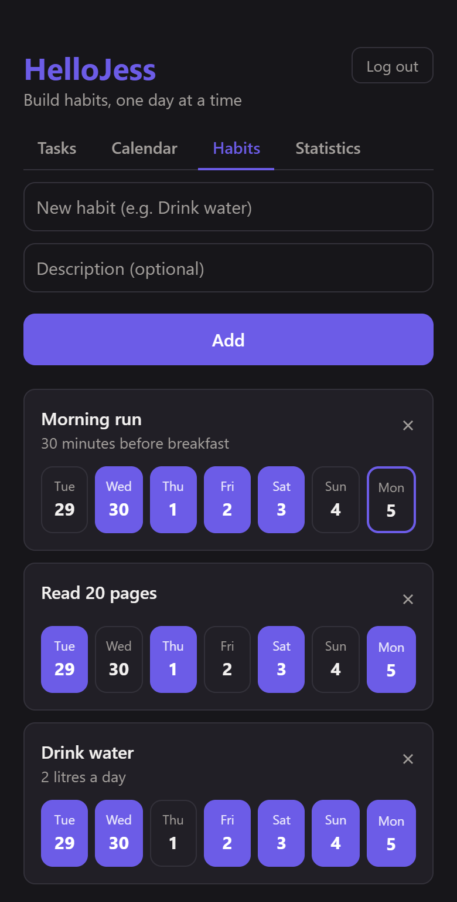</td>
    <td>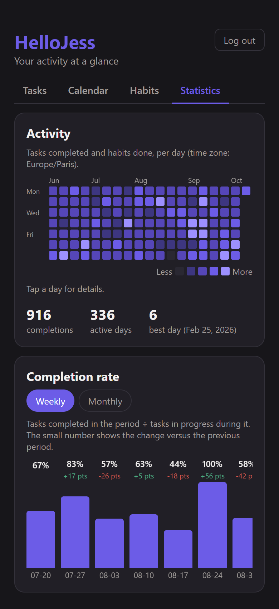</td>
    <td>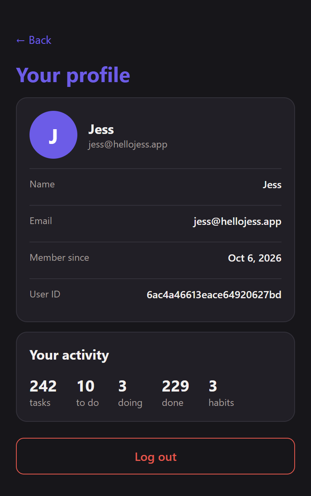</td>
  </tr>
</table>

## What is implemented

**Mandatory part (MVP)** — registration/login, list of your own tasks, add, detail, edit and delete, validation with clear error messages, persistent storage (MongoDB), and authorization enforced by the API (you can never read or change someone else's task).

**Bonuses**

| Bonus | Feature |
| --- | --- |
| **B1** | `priority` field (`low`, `medium`, `high`), filters by status, priority and due date (overdue / today / next 7 days / no date), and a task counter per status |
| **B2** | Second entity **`Habit`** with dated completion events (one per habit per day). A habit is recurring; a one-off task that is checked off is not a habit |
| **B3** | GitHub-style **heatmap**: daily aggregation of completed tasks and habit completions, calendar grid, legend, days with no activity shown, time zones handled |
| **B4** | **Statistics**: weekly (or monthly) completion rate, evolution versus the previous period, with documented and unit-tested calculations |

**Extra** — a **calendar** page (web and mobile): a month grid with a colour per kind of event, and the selected day's events listed below.

- Open tasks appear on their due date, or on the day they were added when they have no due date, so a new task always shows up.
- Tasks are coloured by status: **to do** purple, **doing** orange, **done** green (shown on the day they were completed). **Habits** are blue.
- A task whose due date has passed keeps its status colour with a **red outline**. Overdue tasks that are due before the visible grid (for example last month) are carried onto today, so they are never hidden.

**Profile** — the logged-in user's name and email are always shown at the top of every screen (web and mobile). Clicking or tapping them opens a **profile page** with the account details (name, email, member since, user ID) and a summary of the account's activity (tasks by status, habits). From there you can **edit your name and email**: the header updates immediately, an email that is invalid or already used is refused with a clear message, and you keep your tasks and habits.

## Structure

- `backend/` — Node.js + Express + MongoDB (Mongoose) + JWT auth
- `web/` — React + TypeScript (Vite)
- `mobile/` — React Native (Expo) for iOS/Android

Backend layout (`backend/src`): `config` (env + database connection), `models` (Mongoose schemas), `controllers` (request handling), `routes` (URL → controller wiring), `services` (`app.js` mounts the API routes under `/api`, `server.js` connects to MongoDB and starts listening, plus the business logic in `taskService.js`, `habitService.js`, `statsService.js`, `calendarService.js`), `utils/dates.js` (calendar dates and time zones). Tests are in `backend/test`.

## Running the backend

```bash
cd backend
npm install
npm run dev
```

Requires Node 22+ and a running MongoDB server. The server listens on `0.0.0.0:8000` so phones on the same Wi-Fi can reach it.

Settings live in `backend/src/config/env.js` and can be overridden with environment variables (copy `backend/.env.example` to `backend/.env`):

| Variable | Default | Purpose |
| --- | --- | --- |
| `PORT` | `8000` | Port the API listens on |
| `MONGODB_URI` | `mongodb://127.0.0.1:27017/hellojess` | MongoDB connection string |
| `CORS_ORIGIN` | `*` | Allowed browser origin(s), comma-separated |
| `SECRET_KEY` | dev placeholder | Secret used to sign login tokens — change it outside local development |

The database and its collections (`users`, `tasks`, `habits`, `habitevents`) are created automatically on first use. To browse the data in **MongoDB Compass**, connect to the same `MONGODB_URI` (locally: `mongodb://localhost:27017`) and open the `hellojess` database.

### Tests

```bash
cd backend
npm test
```

60 tests (Node's built-in test runner, no database needed) cover the date utilities (leap years, weeks, daylight-saving changes), the validation rules of every field (tasks, habits and profile), the login tokens and password hashing, the heatmap, the completion-rate calculations and the calendar events.

## The `Task` model

| Field | Rule | Required on `POST` |
| --- | --- | --- |
| `title` | String, trimmed, 1 to 120 characters | Yes |
| `status` | Exactly `todo`, `doing` or `done` | Yes |
| `description` | String of 0 to 1000 characters (empty string accepted) | No |
| `dueDate` | A real calendar date `YYYY-MM-DD` (`2026-02-30` is refused), or `null` | No |
| `priority` | `low`, `medium` (default) or `high` — bonus B1 | No |
| `completedAt` | Set by the server when the status becomes `done`, cleared when it leaves `done` | Never (read-only) |
| `id`, `createdAt`, `updatedAt` | Set by the server | Never |

`dueDate` is a plain calendar day (no time, no time zone), so it never shifts depending on where you are.

## API

All routes except register, login and `/health` need the header `Authorization: Bearer <token>` (returned by register/login). The web and mobile apps add the `/api` prefix themselves, so their `VITE_API_URL` / `EXPO_PUBLIC_API_URL` stay as the plain server address.

| Method and path | What it does |
| --- | --- |
| `POST /api/auth/register` · `POST /api/auth/login` · `GET /api/auth/me` | Account (login takes a JSON body `{ email, password }`) |
| `PATCH /api/auth/me` | Edit your profile: `{ name?, email? }` (only the fields sent change). Returns the updated user and a fresh token; `400` if the email is already used, `422` if a value is invalid |
| `GET /api/tasks` | Your tasks. Optional filters: `status`, `priority`, `dueFrom`, `dueTo` (inclusive), `noDueDate=true` |
| `GET /api/tasks/count` | Counter: `{ total, todo, doing, done }` |
| `POST /api/tasks` · `GET /api/tasks/:id` · `PATCH /api/tasks/:id` · `DELETE /api/tasks/:id` | Create, detail, edit (only the fields sent change), delete |
| `GET /api/habits` · `POST /api/habits` · `GET`/`PATCH`/`DELETE /api/habits/:id` | Habits (`?from=&to=` adds the days each one was done). Deleting a habit deletes its events |
| `GET /api/habits/:id/events` · `POST /api/habits/:id/events` · `DELETE /api/habits/:id/events/:date` | Dated completions (`{ "date": "2026-10-05" }`, one per habit per day) |
| `GET /api/calendar?from=&to=&tz=` | Calendar events for a period (at most 62 days): open tasks (with their `status`), overdue tasks carried onto today, completed tasks and habit completions |
| `GET /api/stats/heatmap?from=&to=&tz=` | Heatmap data (default: the last 52 weeks, at most 366 days) |
| `GET /api/stats/completion?period=week\|month&count=12&tz=` | Completion rate per period |
| `GET /health` | Is the server up? |

**Errors.** Invalid input gets a `422` with one message per field, for example `{ "detail": "Validation failed", "errors": [{ "field": "title", "message": "title must not be empty" }] }`. Other errors use `{ "detail": "..." }`: `400` (email already registered), `401` (not logged in or bad credentials), `404` (not found), `500`. The web and mobile apps show these messages.

**Authorization.** Every query is scoped to the logged-in user. A task, habit or event that belongs to someone else behaves exactly like one that does not exist (`404`), and the owner can never be changed through the API.

## Statistics: how they are calculated

Everything is computed on **calendar days in the user's time zone** (`tz`, e.g. `Europe/Paris`, sent automatically by the apps; default `UTC`). A task completed at 23:30 UTC on 1 March counts for 2 March in Paris but for 1 March in New York. Habit events already store the user's own calendar day. Weeks run Monday to Sunday and months are calendar months. Daylight-saving days (23 or 25 hours) are handled by converting each instant to a calendar day instead of doing arithmetic on hours.

**Heatmap (B3).** One entry per day of the period, **including days with no activity**: `tasks` (tasks completed that day), `habits` (habit completions that day), `total`, and a `level` from 0 to 4 (`0` when `total` is 0, otherwise `ceil(total / max × 4)`, where `max` is the busiest day of the period). The clients draw the grid, the month labels, the legend and a tooltip per day.

**Completion rate (B4).** For each period:

- **completed** = tasks whose completion day falls in the period
- **workload** = tasks "in play" during the period: created on or before its last day, and not completed before its first day
- **rate** = completed ÷ workload, between 0 and 1 — or `null` (not 0) when the workload is 0, because a rate cannot be measured on zero tasks
- **change** = rate minus the previous period's rate (`null` if either is `null`)

Example: a task created before the week and finished during it counts in both `completed` and `workload`; a task created later in the week and still open counts only in `workload`. Known limitation: reopening a completed task clears its completion date, so it no longer counts as completed in the past.

## Running the web app

```bash
cd web
npm run dev
```

Opens at http://localhost:5173. Uses `web/.env` → `VITE_API_URL` to find the backend (defaults to `http://localhost:8000`).

## Running the mobile app

```bash
cd mobile
npx expo start
```

Scan the QR code with **Expo Go** (iOS/Android) to run it on your phone, or press `a`/`i` for an emulator.

Uses `mobile/.env` → `EXPO_PUBLIC_API_URL`, currently set to `http://192.168.1.250:8000` (your machine's LAN IP). **If your IP changes or you're on a different network, update this file** — a phone can't reach `localhost`, it needs your computer's actual LAN address. Find it with `ipconfig` (look for "IPv4 Address").

For the Android emulator specifically, `http://10.0.2.2:8000` also works instead of the LAN IP.

## Accounts / auth

Register creates an account and logs you in immediately (JWT stored in browser localStorage on web, AsyncStorage on mobile). The token identifies the user by their id, not their email, so changing your email never logs you out of anything. Tasks, habits and statistics are private per-user.
